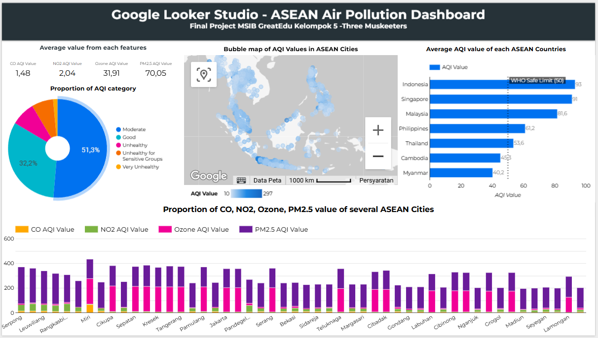

# 💨 ASEAN-Air-Pollution: Urban Air Quality Clustering Across ASEAN

This repository hosts the analysis and code for the **ASEAN-Air-Pollution** project. This data-driven initiative utilizes a broad international air quality dataset, but focuses specifically on implementing **clustering techniques** to group urban areas across the **ASEAN** (Association of Southeast Asian Nations) member states based on their historical air quality metrics.

The objective is to leverage comprehensive global or regional data sources to extract and analyze detailed profiles of air pollution within the ASEAN region, thereby providing granular insights to inform regional environmental policy and mitigation strategies.

---

## 🧐 Project Goals

The project is structured around five core objectives:

1.  **Data Sourcing & Extraction:** Source a comprehensive dataset of historical air quality data. The primary focus is on **extracting and isolating data pertinent to ASEAN member cities**.
2.  **Data Engineering:** Implement robust cleaning, preprocessing, and feature engineering pipelines tailored for the selected ASEAN city data.
3.  **Clustering Analysis:** Apply unsupervised machine learning algorithms to group ASEAN cities based on their multivariate air quality features.
4.  **Visualization:** Create compelling visualizations, including an interactive geospatial dashboard, to map and interpret the resulting city clusters.
5.  **Insight Generation:** Deliver actionable insights regarding regional air pollution patterns, temporal trends, and potential transboundary influences relevant to ASEAN policymakers.
---
## 📝 Key Findings and Deliverables

The full details of the clustering analysis are available in the `3.0_Clustering_Modeling.ipynb` notebook.

### 📊 Interactive Dashboard (Looker Studio)

For a visually intuitive and **interactive summary** of the results, including cluster maps and comparative metrics, please visit the dedicated dashboard:

## 🛠 Technology Stack

This project is built using **Python** as the core programming language. Key libraries used for data science and analysis include:

* **Data Manipulation:** Pandas and NumPy.
* **Machine Learning:** Scikit-learn for implementing clustering algorithms.
* **Visualization:** Matplotlib, Seaborn, Plotly, and Folium for static and interactive mapping.
* **Dashboarding:** **Looker Studio** for final results presentation and interactive exploration.
* **Environment:** Jupyter Notebooks for iterative development and documentation.

---
